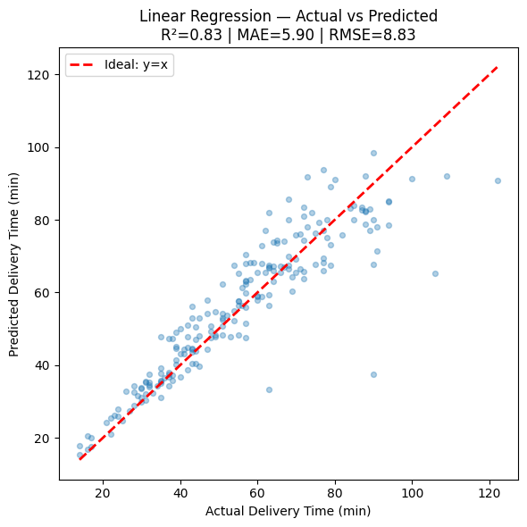
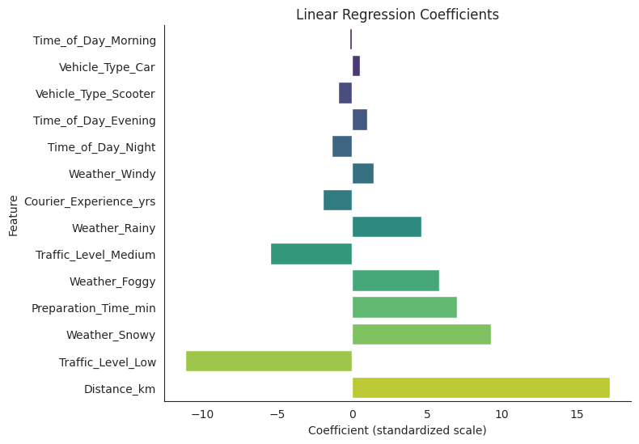

# ⏱️ Optimizing Food Delivery Time Prediction

# 📂 Dataset
  - Sumber: Kaggle [dataset](https://www.kaggle.com/datasets/denkuznetz/food-delivery-time-prediction/code)
  - Jumlah data: 1000 baris, 9 fitur
  - Fitur utama: Distance, Preparation Time, Courier Experience, Weather, Traffic Level, Vehicle Type, Time of Day
  - Target: Delivery Time (minutes)

# ⚙️ Modeling Approach
  - Preprocessing: Handling missing values, drop duplicates, outlier check
  - Encoding & Scaling dengan ColumnTransformer
  - Algorithms: Linear Regression, Ridge, Lasso, ElasticNet, Random Forest, XGBoost
  - Hyperparameter Tuning

# 📊 Results

| Model                               | MAE (min) | RMSE (min) | R²       | MAPE (%)  |
| ----------------------------------- | --------- | ---------- | -------- | --------- |
| **Linear Regression (Baseline)**    | **5.90**  | **8.83**   | **0.83** | **10.41** |
| Random Forest (Baseline)            | 7.02      | 10.21      | 0.77     | 13.05     |
| XGBoost (Baseline)                  | 7.02      | 10.08      | 0.77     | 12.92     |
| Ridge Regression (Tuned α=0.1)      | 5.90      | 8.83       | 0.83     | 10.41     |
| Lasso Regression (Tuned α=0.001)    | 5.90      | 8.83       | 0.83     | 10.41     |
| Elastic Net (Tuned α=0.001, l1=0.9) | 5.90      | 8.83       | 0.83     | 10.42     |
| Random Forest (Tuned)               | 6.99      | 10.13      | 0.77     | 13.27     |
| XGBoost (Tuned)                     | 6.50      | 9.47       | 0.80     | 12.16     |

  - Model Terbaik: Linear Regression → MAE ~6 menit, R² = 0.83.
  - Faktor paling berpengaruh: Distance, Weather, Preparation Time, Traffic Level

# Streamlit Demo
  - https://deliverytimepred.streamlit.app/

# Visual

